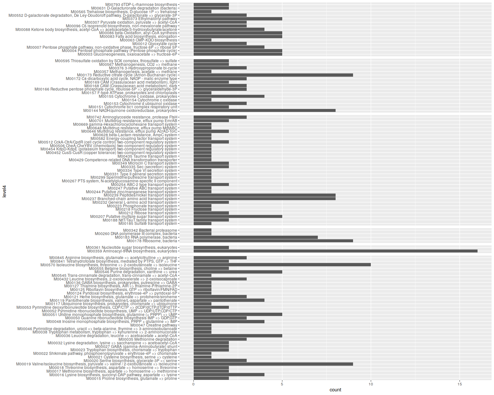

# keggR

A tool to parse the results of BLAST/DIAMOND similarity searches made against the KEGG GENES prokaryotes database.  
Distributed under the terms of the GNU AGPL v3 <<https://www.gnu.org/licenses/agpl.html>>.

Version: 0.0.9  
Author: Igor S. Pessi  
E-mail: igor.pessi@gmail.com

## Installing

    library("devtools")
    install_github("igorspp/keggR")

## Usage example

### Load required packages

    library("tidyverse")
    library("keggR")

### Format the KEGG auxiliary data

The first step is to run *formatKEGG()* to format the KEGG auxiliary files.  
**[COMING UP, NOT YET IMPLEMENTED]**.

### Load KEGG auxiliary data

Then we load the formatted auxiliary files.  
For this, you need to run *loadKEGG()* giving the path to where the formatted files are located:

    loadKEGG("~/KEGG")

      ## Reading PROKARYOTES.DAT
      ## Reading KO00000
      ## Reading KO00001
      ## Reading KO00002

### Read BLAST results

The primary input for keggR is a BLAST/DIAMOND output table in the tabular format (outfmt 6) and with only one target sequence per query  
(e.g. by running DIAMOND with options --max-target-seqs 1 and --max-hsps 1).  
keggR does not perform any filtering of hits, so make sure you use appropriate percentage and/or evalue cutoffs.  

    blast <- readBlast("examples/input_data.txt")

    blast

      ## keggR BLAST table
      ## Access data with getBlastTable()

To acess the data we use *getBlastTable()*:

    getBlastTable(blast)

      ## # A tibble: 1,000 x 2
      ##    sequence target          
      ##    <chr>    <chr>           
      ##  1 read1    gsu:GSU2105     
      ##  2 read100  nao:Y958_17325  
      ##  3 read1007 saci:Sinac_6173
      ##  4 read101  mno:Mnod_6583   
      ##  5 read1011 say:TPY_0862    
      ##  6 read1018 fgi:OP10G_3216  
      ##  7 read1021 aba:Acid345_3980
      ##  8 read1027 vpe:Varpa_4601  
      ##  9 read1028 ges:VT84_09780  
      ## 10 read1029 pbor:BSF38_04859
      ## # … with 990 more rows

### Assign KOs

Now we use *assignKEGG()* to assign KO identifiers to the sequences:

    KOtable <- blast %>%
      assignKEGG

### Run MinPath

It is a good idead to use MinPath (https://omics.informatics.indiana.edu/MinPath) to remove spurious pathways.  
For this you need to have MinPath installed in your $PATH.

    KOtable <- KOtable %>%
      runMinpath

    KOtable

      ## keggR KO table
      ## Access data with getKOtable()
      ##
      ## SEQUENCES
      ## ---------
      ## Sequences in input file:               994
      ## Sequences assigned to a KO identifier: 554
      ## Sequences assigned to a pathway:       386
      ## Sequences assigned to a module:        248
      ##
      ## PATHWAYS
      ## --------
      ## Number of pathways: 154
      ##
      ## MODULES
      ## -------
      ## Number of modules: 161
      ##
      ## MINPATH
      ## -------
      ## Pathways removed: 83
      ## Modules removed:  59

To acess the data we use *getKOTable()*:

    getKOtable(KOtable)

      ## # A tibble: 2,194 x 5
      ##    sequence KO     gene                                               pathway                                   module                            
      ##    <chr>    <chr>  <chr>                                              <chr>                                     <chr>                             
      ##  1 read1    K01338 lon; ATP-dependent Lon protease                    04112 Cell cycle - Caulobacter            NA                                
      ##  2 read2    K13894 yejB; microcin C transport system permease protein 02010 ABC transporters                    M00349 Microcin C transport system
      ##  3 read5    NA     NA                                                 NA                                        NA                                
      ##  4 read6    NA     NA                                                 NA                                        NA                                
      ##  5 read7    NA     NA                                                 NA                                        NA                                
      ##  6 read11   K04077 groEL, HSPD1; chaperonin GroEL                     03018 RNA degradation                     NA                                
      ##  7 read11   K04077 groEL, HSPD1; chaperonin GroEL                     04212 Longevity regulating pathway - worm NA                                
      ##  8 read11   K04077 groEL, HSPD1; chaperonin GroEL                     04940 Type I diabetes mellitus            NA                                
      ##  9 read11   K04077 groEL, HSPD1; chaperonin GroEL                     05134 Legionellosis                       NA                                
      ## 10 read11   K04077 groEL, HSPD1; chaperonin GroEL                     05152 Tuberculosis                        NA                                
      ## # … with 2,184 more rows

# Summarise
    summary <- KOtable %>%
      summariseKEGG

    summary

      ## keggR summary table
      ## Access data with getSummary()    

To access the data we use *getSummary()*:

    getSummary(summary, "pathways", "level3")

      ## # A tibble: 71 x 4
      ##    level1                               level2                           level3                                     count
      ##    <chr>                                <chr>                            <chr>                                      <int>
      ##  1 Cellular Processes                   Cell growth and death            04112 Cell cycle - Caulobacter                 9
      ##  2 Cellular Processes                   Cellular community - prokaryotes 02024 Quorum sensing                          27
      ##  3 Cellular Processes                   Cellular community - prokaryotes 02026 Biofilm formation - Escherichia coli     3
      ##  4 Cellular Processes                   Cellular community - prokaryotes 05111 Biofilm formation - Vibrio cholerae      5
      ##  5 Cellular Processes                   Transport and catabolism         04146 Peroxisome                               7
      ##  6 Environmental Information Processing Membrane transport               02010 ABC transporters                        23
      ##  7 Environmental Information Processing Membrane transport               02060 Phosphotransferase system (PTS)          2
      ##  8 Environmental Information Processing Membrane transport               03070 Bacterial secretion system               4
      ##  9 Environmental Information Processing Signal transduction              02020 Two-component system                    24
      ## 10 Genetic Information Processing       Folding, sorting and degradation 03018 RNA degradation                          9
      ## # … with 61 more rows

    getSummary(summary, "modules", "level4")

      ## # A tibble: 102 x 5
      ##    level1         level2                               level3                          level4                                                                     count
      ##    <chr>          <chr>                                <chr>                           <chr>                                                                      <int>
      ##  1 Functional set Environmental information processing Drug efflux transporter/pump    M00646 Multidrug resistance, efflux pump AcrAD-TolC                            2
      ##  2 Functional set Environmental information processing Drug efflux transporter/pump    M00648 Multidrug resistance, efflux pump MdtABC                                1
      ##  3 Functional set Environmental information processing Drug efflux transporter/pump    M00701 Multidrug resistance, efflux pump EmrAB                                 2
      ##  4 Functional set Environmental information processing Drug resistance                 M00628 beta-Lactam resistance, AmpC system                                     1
      ##  5 Functional set Environmental information processing Drug resistance                 M00742 Aminoglycoside resistance, protease FtsH                                3
      ##  6 Functional set Environmental information processing Two-component regulatory system M00452 CusS-CusR (copper tolerance) two-component regulatory system            1
      ##  7 Functional set Environmental information processing Two-component regulatory system M00454 KdpD-KdpE (potassium transport) two-component regulatory system         1
      ##  8 Functional set Environmental information processing Two-component regulatory system M00506 CheA-CheYBV (chemotaxis) two-component regulatory system                1
      ##  9 Functional set Environmental information processing Two-component regulatory system M00512 CckA-CtrA/CpdR (cell cycle control) two-component regulatory system     2
      ## 10 Functional set Metabolism                           Aminoacyl tRNA                  M00359 Aminoacyl-tRNA biosynthesis, eukaryotes                                16
      ## # … with 92 more rows

### Plot examples

    getSummary(summary, "modules", "level4") %>%
      ggplot(aes(x = level4, y = count)) +
      geom_bar(stat="identity") +
      facet_grid("level2", scales = "free", space = "free") +
      theme(strip.text = element_blank()) +
      coord_flip()

